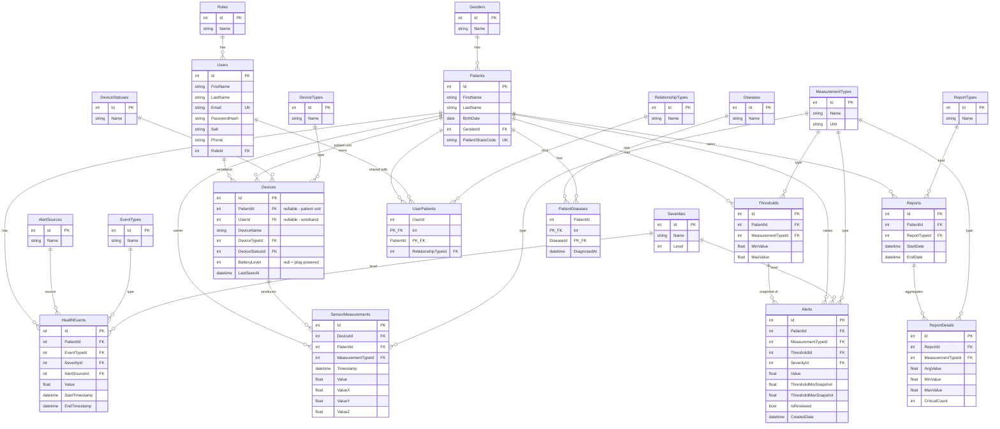

# VitalWatch — Hasta Yaşamsal Takip Sistemi

Bu proje yaşlı / kronik hastalığı olan kişileri evde uzaktan izlemek için geliştirilmiş **iki bileşenli bir sistemdir**:

1. **VitalWatch.Api** — ASP.NET Core 8 + EF Core + PostgreSQL backend (REST + SignalR)
2. **vital_watch_app** — Flutter mobil uygulaması (iOS & Android)

Sistemde her hastada bir **Hasta Ünitesi** (PatientUnit) bulunur ve hayati değerleri sürekli ölçer. Bakıcı ise üzerinde bir **Bilekliğe** (SmartWatch) sahiptir; herhangi bir kritik durumda bileklik buzzer ile uyarır.

---

## 1. Mimari

```
┌──────────────────┐         REST + SignalR        ┌─────────────────────┐
│  Flutter Mobile  │ ◄───────────────────────────► │   ASP.NET Core API  │
│  (iOS / Android) │                                │  + SignalR Hub      │
└──────────────────┘                                │  + Simulation Svc   │
                                                    └──────────┬──────────┘
                                                               │ EF Core
                                                               ▼
                                                    ┌─────────────────────┐
                                                    │     PostgreSQL      │
                                                    └─────────────────────┘
```

**Backend bileşenleri**
- **REST API** — kullanıcı, hasta, cihaz, alert, threshold, rapor CRUD
- **SignalR Hub** (`/hubs/vital`) — gerçek zamanlı vital + alert yayını
- **SimulationService** (Singleton) — IoT cihaz yokluğunda demo için sahte veri üretir, threshold ihlal ettiğinde alert tetikler, periyodik nöbet enjekte eder
- **AlertService** — gelen ölçümleri threshold ile karşılaştırır, ihlal varsa Alert + HealthEvent oluşturur ve SignalR ile yayınlar
- **ThresholdService** — yeni hasta için varsayılan tıbbi eşikleri (HR 50-120, SpO2 92-100, Resp 10-24, Temp 36-37.8) otomatik kurar

**Mobile bileşenleri**
- JWT Bearer auth (SharedPreferences'ta persist)
- 401 → otomatik logout (`SessionManager.forceLogout()`)
- Platform farkındalıklı URL: iOS = `localhost`, Android = PC Wi-Fi IP
- SignalR client → `VitalUpdate` ve `Alert` event'lerini dinler
- 4 ana sekme: Dashboard, Cihazlar, Raporlar, Hastalar

---

## 2. Veri Tabanı

### 2.1 ER Diyagramı



### 2.2 Lookup tabloları (seed verileri)

| Tablo | Değerler |
|---|---|
| **Roles** | 1=Caregiver, 2=Relative |
| **Genders** | 1=Male, 2=Female, 3=Other |
| **DeviceTypes** | 1=SmartWatch (bileklik), 2=PatientUnit (hasta ünitesi), 3=MotionSensor, 4=PulseOximeter |
| **DeviceStatuses** | 1=Active, 2=Inactive, 3=Maintenance |
| **MeasurementTypes** | 1=HeartRate (bpm), 2=SpO2 (%), 3=Respiration (rpm), 4-6=Accelerometer X/Y/Z (g), 7=BodyTemperature (°C) |
| **Severities** | 1=Low, 2=Medium, 3=High, 4=Critical |
| **EventTypes** | 1=Seizure, 2=FallDetected, 3=LowSpO2, 4=HighHeartRate, 5=LowHeartRate, 6=Apnea |
| **AlertSources** | 1=Sensor, 2=Manual, 3=System |
| **RelationshipTypes** | 1=Caregiver, 2=Relative |
| **ReportTypes** | 1=Daily, 2=Weekly, 3=CriticalSummary |
| **Diseases** | Epilepsi, KOAH, Diyabet, Hipertansiyon, Alzheimer, Parkinson, Astım, Kalp Yetmezliği, Demans, Felç, Diğer |

---

## 3. İş Akışları

### 3.1 Hasta ekleme
```
Caregiver hasta ekler
   → Patient kaydı (auto-generated 8 char PatientShareCode)
   → UserPatient (RelationshipType=Caregiver) kaydı
   → Patient'a tek bir Hasta Ünitesi (PatientUnit) cihazı eklenir
   → Varsayılan Threshold'lar otomatik eklenir
   → Frontend'e PatientShareCode dönülür ve dialog ile gösterilir
```

### 3.2 Hastayı paylaşma
```
Caregiver kodu (örn: A3F2B1C9) Relative'e iletir
Relative mobilde "Kod ile Bağlan" ile kodu girer
   → POST /api/Patients/VerifyCode
   → UserPatient (RelationshipType=Relative) kaydı oluşur
Relative artık o hastanın verilerini görür (sadece okuma)
```

### 3.3 Vital ölçüm + Threshold + Alert
```
SensorMeasurement geldi (gerçek IoT veya Simulation)
   → DB'ye yazılır
   → SignalR ile "VitalUpdate" yayınlanır
   → AlertService.EvaluateMeasurement çağrılır
       → Patient + MeasurementType için Threshold bulunur
       → Min/Max dışında ise:
           - Alert kaydı oluşur (ThresholdMin/Max snapshot ile)
           - HealthEvent kaydı oluşur (sensor source)
           - Severity sapma oranına göre hesaplanır
           - SignalR "Alert" event yayınlanır → bakıcı bilekliği titrer
       → Accelerometer magnitude > 25 ise:
           - Seizure HealthEvent (Critical)
           - SignalR "HealthEvent" event
```

### 3.4 Simülasyon
```
POST /api/SensorData/Simulation/Start/{patientId}
   → O hastaya ait önceki SensorMeasurements + Alerts + HealthEvents silinir
   → Background Task başlar: her 2 sn'de bir HR/SpO2/Resp/Accel üretir
   → Her ~12 sn'de bir nöbet senaryosu enjekte edilir
       (HR fırlar, SpO2 düşer, accelerometer magnitude > threshold)
   → Hocaya demo için ayarlanmış oran
```

---

## 4. Teknolojiler

| Katman | Teknoloji |
|---|---|
| Backend | ASP.NET Core 8, EF Core 8, Microsoft.AspNetCore.SignalR |
| DB | PostgreSQL (Npgsql) |
| Auth | JWT Bearer + PBKDF2/SHA512 password hashing |
| Mobile | Flutter, http, signalr_netcore, shared_preferences, fl_chart, google_fonts |

---

## 5. Demo Akışı (Hocaya Sunum)

1. Backend'i başlat: `dotnet run` (port 5000)
2. Mobil cihazda login (Mehmet / 123456)
3. Hastalar listesinde Ayşe seç → Dashboard
4. Sağ üst Simülasyon Başlat → 2 sn'de canlı vitaller akmaya başlar
5. ~12 sn içinde nöbet → Dashboard'da kritik alarmı + bileklikte buzzer
6. Raporlar sekmesi → o hastaya ait tüm HealthEvent listesi (severity ile)
7. Caregiver kodunu paylaş → ikinci telefonda Relative login → aynı hastayı izlesin

---

## 6. SQL Sorguları (İlişkisel Analiz)

Aşağıdaki 15 sorgu projedeki ilişkisel veri yapısının nasıl çalıştığını gösterir.

### 6.1 Bir bakıcının tüm hastalarını ve hastalıklarını listele
```sql
SELECT u."FirstName" || ' ' || u."LastName" AS "Bakici",
       p."FirstName" || ' ' || p."LastName" AS "Hasta",
       p."BirthDate",
       d."Name" AS "Hastalik"
FROM "Users" u
JOIN "UserPatients" up ON up."UserId" = u."Id"
JOIN "Patients" p ON p."Id" = up."PatientId"
LEFT JOIN "PatientDiseases" pd ON pd."PatientId" = p."Id"
LEFT JOIN "Diseases" d ON d."Id" = pd."DiseaseId"
WHERE u."Email" = 'mmt.altnl@gmail.com';
```

### 6.2 Hastaların yaş ortalaması (cinsiyete göre)
```sql
SELECT g."Name" AS "Cinsiyet",
       COUNT(*) AS "HastaSayisi",
       ROUND(AVG(EXTRACT(YEAR FROM AGE(p."BirthDate"))), 1) AS "OrtalamaYas"
FROM "Patients" p
JOIN "Genders" g ON g."Id" = p."GenderId"
GROUP BY g."Name"
ORDER BY "HastaSayisi" DESC;
```

### 6.3 Son 24 saatte en çok alarm üreten hastalar (Top 5)
```sql
SELECT p."FirstName" || ' ' || p."LastName" AS "Hasta",
       COUNT(a."Id") AS "AlertSayisi",
       SUM(CASE WHEN s."Name" = 'Critical' THEN 1 ELSE 0 END) AS "KritikSayisi"
FROM "Alerts" a
JOIN "Patients" p ON p."Id" = a."PatientId"
JOIN "Severities" s ON s."Id" = a."SeverityId"
WHERE a."CreatedDate" >= NOW() - INTERVAL '24 hours'
GROUP BY p."Id", p."FirstName", p."LastName"
ORDER BY "KritikSayisi" DESC, "AlertSayisi" DESC
LIMIT 5;
```

### 6.4 İki hastayı vital değerleri açısından karşılaştır
```sql
SELECT p."FirstName" AS "Hasta",
       mt."Name" AS "Olcum",
       mt."Unit" AS "Birim",
       ROUND(AVG(sm."Value")::numeric, 2) AS "Ortalama",
       ROUND(MIN(sm."Value")::numeric, 2) AS "Min",
       ROUND(MAX(sm."Value")::numeric, 2) AS "Max",
       COUNT(*) AS "OlcumSayisi"
FROM "SensorMeasurements" sm
JOIN "Patients" p ON p."Id" = sm."PatientId"
JOIN "MeasurementTypes" mt ON mt."Id" = sm."MeasurementTypeId"
WHERE p."Id" IN (1, 2)              -- karşılaştırılacak hasta ID'leri
  AND sm."Timestamp" >= NOW() - INTERVAL '7 days'
GROUP BY p."FirstName", mt."Name", mt."Unit"
ORDER BY mt."Name", p."FirstName";
```

### 6.5 Threshold'u en çok aşılan ölçüm türü
```sql
SELECT mt."Name" AS "Olcum",
       COUNT(a."Id") AS "IhlalSayisi",
       ROUND(AVG(a."Value")::numeric, 2) AS "OrtalamaIhlalDegeri",
       ROUND(AVG(a."ThresholdMaxSnapshot")::numeric, 2) AS "OrtalamaUstSinir"
FROM "Alerts" a
JOIN "MeasurementTypes" mt ON mt."Id" = a."MeasurementTypeId"
GROUP BY mt."Name"
ORDER BY "IhlalSayisi" DESC;
```

### 6.6 Belirli bir hastalığa sahip hastaların ortalama nabzı
```sql
SELECT d."Name" AS "Hastalik",
       COUNT(DISTINCT p."Id") AS "HastaSayisi",
       ROUND(AVG(sm."Value")::numeric, 1) AS "OrtalamaNabiz"
FROM "Diseases" d
JOIN "PatientDiseases" pd ON pd."DiseaseId" = d."Id"
JOIN "Patients" p ON p."Id" = pd."PatientId"
JOIN "SensorMeasurements" sm ON sm."PatientId" = p."Id"
WHERE sm."MeasurementTypeId" = 1   -- HeartRate
GROUP BY d."Name"
HAVING COUNT(DISTINCT p."Id") > 0
ORDER BY "OrtalamaNabiz" DESC;
```

### 6.7 Bakıcı-Hasta-Cihaz topolojisi (bütüncül görünüm)
```sql
SELECT u."FirstName" AS "Bakici",
       p."FirstName" AS "Hasta",
       dev_user."DeviceName" AS "BakiciCihazi",
       dev_user."BatteryLevel" AS "BakiciPili",
       dev_pat."DeviceName" AS "HastaCihazi",
       ds_pat."Name" AS "HastaCihazDurumu"
FROM "UserPatients" up
JOIN "Users" u ON u."Id" = up."UserId"
JOIN "Patients" p ON p."Id" = up."PatientId"
LEFT JOIN "Devices" dev_user ON dev_user."UserId" = u."Id" AND dev_user."IsDeleted" = false
LEFT JOIN "Devices" dev_pat ON dev_pat."PatientId" = p."Id" AND dev_pat."IsDeleted" = false
LEFT JOIN "DeviceStatuses" ds_pat ON ds_pat."Id" = dev_pat."DeviceStatusId"
WHERE up."RelationshipTypeId" = 1   -- Sadece Caregiver ilişkisi
ORDER BY u."FirstName", p."FirstName";
```

### 6.8 Pili kritik (≤20%) cihazlar
```sql
SELECT d."DeviceName",
       dt."Name" AS "Tip",
       d."BatteryLevel",
       COALESCE(p."FirstName" || ' ' || p."LastName", u."FirstName" || ' ' || u."LastName") AS "Sahip",
       d."LastSeenAt"
FROM "Devices" d
JOIN "DeviceTypes" dt ON dt."Id" = d."DeviceTypeId"
LEFT JOIN "Patients" p ON p."Id" = d."PatientId"
LEFT JOIN "Users" u ON u."Id" = d."UserId"
WHERE d."BatteryLevel" IS NOT NULL AND d."BatteryLevel" <= 20
  AND d."IsDeleted" = false
ORDER BY d."BatteryLevel" ASC;
```

### 6.9 Kritik nöbet geçirmiş hastalar ve nöbet sayıları
```sql
SELECT p."FirstName" || ' ' || p."LastName" AS "Hasta",
       et."Name" AS "Olay",
       COUNT(*) AS "OlaySayisi",
       MAX(he."StartTimestamp") AS "SonOlay"
FROM "HealthEvents" he
JOIN "Patients" p ON p."Id" = he."PatientId"
JOIN "EventTypes" et ON et."Id" = he."EventTypeId"
JOIN "Severities" s ON s."Id" = he."SeverityId"
WHERE s."Name" = 'Critical'
GROUP BY p."Id", p."FirstName", p."LastName", et."Name"
ORDER BY "OlaySayisi" DESC;
```

### 6.10 Henüz onaylanmamış (IsReviewed=false) alarmlar
```sql
SELECT a."Id",
       p."FirstName" AS "Hasta",
       mt."Name" AS "Olcum",
       a."Value",
       a."ThresholdMinSnapshot" || ' - ' || a."ThresholdMaxSnapshot" AS "Esik",
       s."Name" AS "Severity",
       a."CreatedDate"
FROM "Alerts" a
JOIN "Patients" p ON p."Id" = a."PatientId"
JOIN "MeasurementTypes" mt ON mt."Id" = a."MeasurementTypeId"
JOIN "Severities" s ON s."Id" = a."SeverityId"
WHERE a."IsReviewed" = false
ORDER BY s."Level" DESC, a."CreatedDate" DESC;
```

### 6.11 Bir hastanın gün-saatlik nabız trendi
```sql
SELECT DATE_TRUNC('hour', sm."Timestamp") AS "Saat",
       ROUND(AVG(sm."Value")::numeric, 1) AS "OrtalamaNabiz",
       MIN(sm."Value") AS "Min",
       MAX(sm."Value") AS "Max",
       COUNT(*) AS "OlcumSayisi"
FROM "SensorMeasurements" sm
WHERE sm."PatientId" = 1
  AND sm."MeasurementTypeId" = 1
  AND sm."Timestamp" >= NOW() - INTERVAL '24 hours'
GROUP BY DATE_TRUNC('hour', sm."Timestamp")
ORDER BY "Saat";
```

### 6.12 Birden fazla bakıcısı olan hastalar (paylaşılmış)
```sql
SELECT p."FirstName" || ' ' || p."LastName" AS "Hasta",
       p."PatientShareCode",
       COUNT(up."UserId") AS "BagliKisiSayisi",
       STRING_AGG(u."FirstName" || ' (' || rt."Name" || ')', ', ') AS "BagliKisiler"
FROM "Patients" p
JOIN "UserPatients" up ON up."PatientId" = p."Id"
JOIN "Users" u ON u."Id" = up."UserId"
JOIN "RelationshipTypes" rt ON rt."Id" = up."RelationshipTypeId"
GROUP BY p."Id", p."FirstName", p."LastName", p."PatientShareCode"
HAVING COUNT(up."UserId") > 1
ORDER BY "BagliKisiSayisi" DESC;
```

### 6.13 Hastaların threshold tablosu — özelleştirilmiş eşikleri görme
```sql
SELECT p."FirstName" AS "Hasta",
       mt."Name" AS "Olcum",
       mt."Unit" AS "Birim",
       t."MinValue",
       t."MaxValue"
FROM "Thresholds" t
JOIN "Patients" p ON p."Id" = t."PatientId"
JOIN "MeasurementTypes" mt ON mt."Id" = t."MeasurementTypeId"
ORDER BY p."Id", mt."Id";
```

### 6.14 Nöbet sırasında ortalama nabız vs normal ortalama nabız (vaka analizi)
```sql
WITH seizure_windows AS (
    SELECT he."PatientId",
           he."StartTimestamp" - INTERVAL '30 seconds' AS "Start",
           he."StartTimestamp" + INTERVAL '30 seconds' AS "End"
    FROM "HealthEvents" he
    JOIN "EventTypes" et ON et."Id" = he."EventTypeId"
    WHERE et."Name" = 'Seizure'
)
SELECT p."FirstName" AS "Hasta",
       ROUND(AVG(CASE WHEN sw."PatientId" IS NOT NULL THEN sm."Value" END)::numeric, 1) AS "NobetSirasiNabiz",
       ROUND(AVG(CASE WHEN sw."PatientId" IS NULL     THEN sm."Value" END)::numeric, 1) AS "NormalNabiz"
FROM "SensorMeasurements" sm
JOIN "Patients" p ON p."Id" = sm."PatientId"
LEFT JOIN seizure_windows sw
       ON sw."PatientId" = sm."PatientId"
      AND sm."Timestamp" BETWEEN sw."Start" AND sw."End"
WHERE sm."MeasurementTypeId" = 1   -- HeartRate
GROUP BY p."FirstName";
```

### 6.15 Haftalık rapor üretimi için aggregate (Daily Report)
```sql
SELECT p."FirstName" AS "Hasta",
       DATE(sm."Timestamp") AS "Gun",
       mt."Name" AS "Olcum",
       ROUND(AVG(sm."Value")::numeric, 2) AS "Avg",
       ROUND(MIN(sm."Value")::numeric, 2) AS "Min",
       ROUND(MAX(sm."Value")::numeric, 2) AS "Max",
       SUM(CASE WHEN sm."Value" < t."MinValue" OR sm."Value" > t."MaxValue" THEN 1 ELSE 0 END) AS "IhlalSayisi"
FROM "SensorMeasurements" sm
JOIN "Patients" p ON p."Id" = sm."PatientId"
JOIN "MeasurementTypes" mt ON mt."Id" = sm."MeasurementTypeId"
LEFT JOIN "Thresholds" t
       ON t."PatientId" = sm."PatientId"
      AND t."MeasurementTypeId" = sm."MeasurementTypeId"
WHERE sm."Timestamp" >= NOW() - INTERVAL '7 days'
GROUP BY p."FirstName", DATE(sm."Timestamp"), mt."Name"
ORDER BY p."FirstName", "Gun" DESC, mt."Name";
```

---

## 7. API Endpoint Özeti

| Method | Path | Açıklama |
|---|---|---|
| POST | `/api/User/Register` | Kayıt (Caregiver ise otomatik bileklik oluşur) |
| POST | `/api/User/Login` | JWT token döner |
| POST | `/api/Patients/Add` | Hasta + Hasta Ünitesi + Threshold otomatik |
| GET | `/api/Patients/MyPatients/{userId}` | Kullanıcının bağlı olduğu hastalar |
| POST | `/api/Patients/VerifyCode` | Share code ile hastaya bağlan |
| GET | `/api/Patients/{id}/ShareCode` | Mevcut hastanın kodunu getir |
| GET | `/api/Devices/Patient/{id}` | Hastaya ait sensör/ünite |
| GET | `/api/Devices/User/{id}` | Bakıcının cihazları (bileklik) |
| POST | `/api/Devices/Add` | Yeni cihaz ekle |
| POST | `/api/SensorData/Ingest` | IoT cihazdan veri al, alarmı tetikle |
| POST | `/api/SensorData/Simulation/Start/{patientId}` | Demo verisi üret |
| GET | `/api/Alerts/Patient/{id}` | Son alarmlar |
| PUT | `/api/Alerts/{id}/Review` | Alarmı okundu işaretle |
| GET | `/api/Thresholds/Patient/{id}` | Hastaya özel eşikler |
| POST | `/api/Thresholds/Upsert` | Eşik tanımla / güncelle |
| GET | `/api/HealthEvents/Patient/{id}/Reports` | Tarih aralığında rapor |
| GET | `/api/Diseases` | Hastalık listesi (dropdown için) |

**SignalR (`/hubs/vital`)**

| Method (server → client) | Payload |
|---|---|
| `VitalUpdate` | `{ patientId, pulse, spO2, respiration, timestamp }` |
| `Alert` | `{ id, patientId, measurementType, severity, value, thresholdMin, thresholdMax }` |
| `HealthEvent` | `{ patientId, eventType, severity, value, timestamp }` |

| Method (client → server) | Açıklama |
|---|---|
| `JoinPatientGroup(patientId)` | Hasta için yayın grubuna abone ol |
| `LeavePatientGroup(patientId)` | Yayın grubundan ayrıl |
